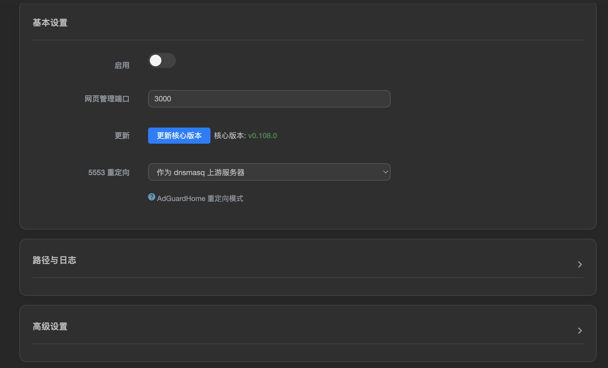
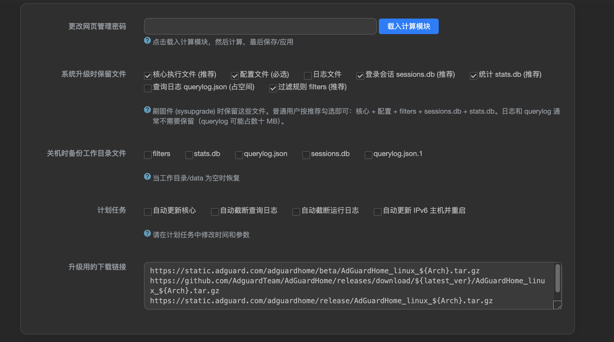
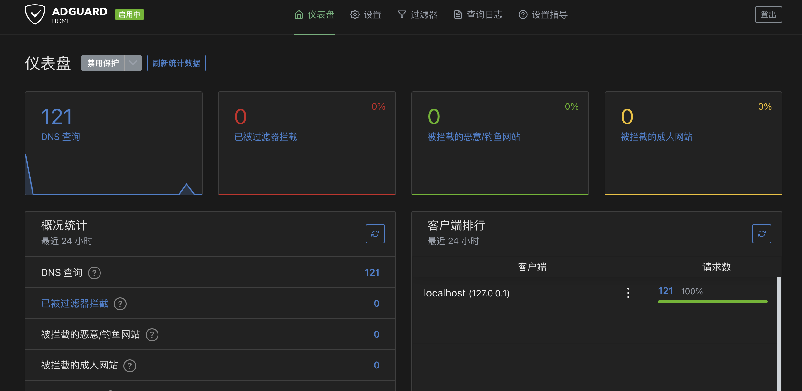
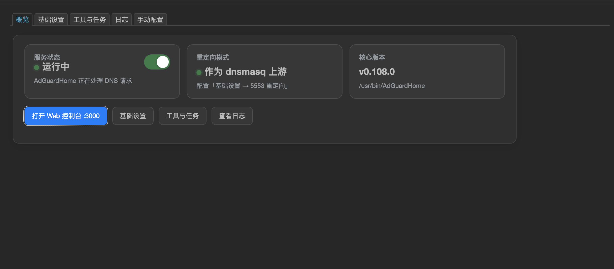

# luci-app-adguardhome

适用于 OpenWrt / ImmortalWrt 的 AdGuard Home LuCI 控制面板。

> 基于 [rufengsuixing/luci-app-adguardhome](https://github.com/rufengsuixing/luci-app-adguardhome) 维护，
> 针对 **ImmortalWrt 24.10+** 进行了大量 UI 重构和 Bug 修复。

## 兼容性

| 系统 | 状态 |
|------|------|
| ImmortalWrt 24.10 / 25.12 | 主要测试目标，完全兼容 |
| OpenWrt 23.05 | 兼容 |
| OpenWrt 21.02 / 22.03 | 兼容 |
| OpenWrt 19.07 | 兼容（jail 字段回退为 TextValue） |
| OpenWrt 18.06 | 基本兼容（DynamicList 自动回退） |

## 截图

### 概览



### 基础设置



### 工具与任务



### 日志



## 近期变更

### 2026-05-18  UI 重构

- **新增「概览」Tab**：三张状态卡（服务/重定向/核心）+ 启用开关 + 快捷入口，作为默认页
- **拆出「工具与任务」Tab**：改密、备份、Crontab、下载源独立于基础设置
- **卡片化样式**：参考 luci-app-clashoo 设计语言，每个 section 渲染为圆角卡片，深浅色自适应
- **路径/进程折叠**：「路径与日志」、「高级设置」默认收起，点击标题切换，localStorage 记忆
- **Jail 字段升级 DynamicList**：每行独立输入框 + 删除按钮，参考 ImmortalWrt 官方实现
- **多项字段精简**：删除 GOGC/GOMAXPROCS、「显示高级设置」复选框、GFW 列表功能
- **日志空态优化**：未配置日志路径时显示提示 + 跳转链接
- **全中文 Tab**：概览 / 基础设置 / 工具与任务 / 日志 / 手动配置
- **Argon / Bootstrap 双主题适配**：移动端 + PC 端无溢出

### 2026-05-18  Bug 修复

- **修复 ImmortalWrt (apk) 架构检测**：`get_arch()` 统一 fallback 链 `opkg → apk → uname -m`
- **修复 UPX 压缩全链路**：GitHub 文件名 v 前缀、xz 装不上 (apk add)、输出路径覆盖输入目录
- **修复版本比较只升不降**：`sort -V` 数字比较替代字符串不等判断
- **修复 Argon 主题 CSS 不加载**：CBI 模板过滤 `<link>`，改 JS 动态注入
- **修复移动端 180px label 高度**：桌面 `min-width:170px` 泄漏到 flex column，加 `!important` 覆盖
- **修复 Bootstrap 表单缩窄**：`max-width:980px` 从表单级移到卡片级

### 2026-05-17

- **移除 GFW 列表功能**：与现代代理工具（clashoo/OpenClash/HomeProxy）的 DNS 分流职责重叠，删除 gfw2adg.sh 及相关字段
- **删除 po/zh-cn symlink**：避免 luci.mk 扫描时 i18n .lmo 文件冲突（kenzok8/openwrt-packages#550）
- **即时启用开关**：ajax toggle，不刷新页面；失败自动回滚 uci

## 功能

- **概览面板**：服务状态、重定向模式、核心版本、一键启停 + Web 控制台快捷入口
- **基础设置**：启用开关、管理端口、核心更新、5553 重定向（4 种模式）、路径配置、进程参数
- **工具与任务**：改密、sysupgrade 保留文件、关机备份、Crontab 计划任务
- **日志查看**：实时轮询、反向/本地时区切换、下载、清空
- **手动配置**：YAML 编辑器（CodeMirror 可选），保存前二次确认
- **核心自动更新**：GitHub/AdGuard 多源下载 → UPX 压缩 → 重启服务
- **UPX 压缩**：>8MB 二进制自动压缩（支持 x86_64 / arm64 / mips 等架构）
- **计划任务**：自动更新核心、切割日志、IPv6 hosts 同步
- **升级保护**：sysupgrade 保留文件 + 关机备份

## 安装

### Feed 方式

```bash
echo 'src-git adguardhome https://github.com/kenzok78/luci-app-adguardhome' >> feeds.conf.default
./scripts/feeds update -a && ./scripts/feeds install -a -p adguardhome
make package/luci-app-adguardhome/compile V=s
```

### 直接编译

```bash
git clone https://github.com/kenzok78/luci-app-adguardhome.git package/luci-app-adguardhome
make menuconfig  # LuCI → Applications → luci-app-adguardhome
make -j$(nproc) V=s
```

## 重定向模式

| 模式 | 说明 |
|------|------|
| 不启用 | 仅运行，不拦截 DNS |
| 作为 dnsmasq 上游 | dnsmasq 转发到 AGH |
| 53 端口劫持 | iptables 重定向到 AGH |
| 替代 dnsmasq | AGH 直接监听 53 |

## 许可证

Apache-2.0
