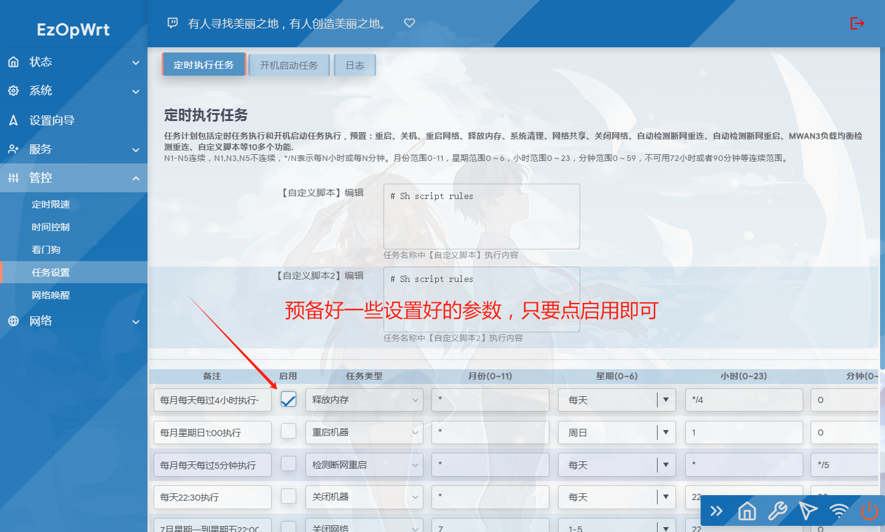
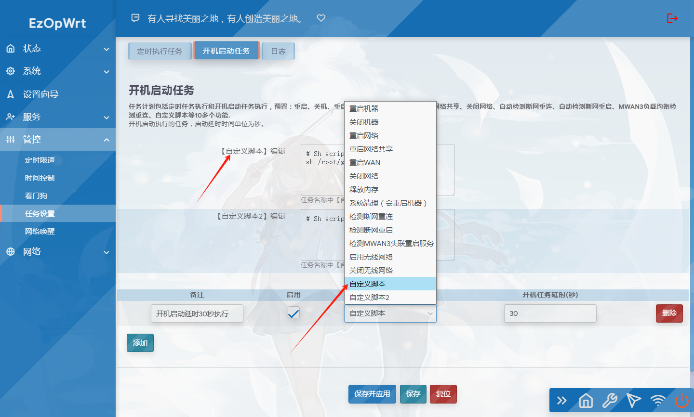

[](#解决-github-网页上图片显示失败的问题) [](https://t.me/joinchat/AAAAAEpRF88NfOK5vBXGBQ)
## 访问数：[](https://t.me/joinchat/AAAAAEpRF88NfOK5vBXGBQ)
### 访问数：[] [](https://t.me/joinchat/AAAAAEpRF88NfOK5vBXGBQ)

[ taskplan 定时设置插件](https://github.com/sirpdboy/luci-app-taskplan)


请 **认真阅读完毕** 本页面，本页面包含注意事项和如何使用。

## 功能说明：

### 任务设置2.2.2版（taskplan）
#### 2025.4.9 任务设置2.2.2版：修复新版导致开机启动任务无效问题。

### 任务设置2.2.1版（taskplan）
#### 2025.3.19 任务设置2.2.1版：为和以前老版本做好区分重命名luci-app-taskplan，配适openwrt24.10.

### 定时设置2.0版
#### 2023.5.23 定时设置2.0版：定时执行任务设置和开机启动任务设置二合一版，并增加自定义脚本功能。

### 定时设置1.9版
#### 2023.4.1 定时设置1.9版：加入定时断网重连、定时检测WAN3重启等服务。

### 定时设置1.6版
#### 2023.1.15 定时设置1.6版：重新代码制作优化。在之前的版本上新增加：定时清理内存、定时清理系统垃圾、定时断网、定时重启网络共享、定时重拨 等 8大功能

### 定时设置1.4版
#### 2021.2.7 新增功能定时重启网络。现包括：定时重启、定时关机、定时重启网络，各功能可一起使用。

### 定时设置1.3版
#### 2020.10.6 原来重定关机正式改名为定时设置，实现定时重启和定时关机功能二合一。

### 定时关机1.1版
#### 2020.7.19  定时关机功能，彻底解决需要保存二次才生效的问题。

### 定时关机1.0版
#### 2019.2.24 定时关机功能借鉴前辈们的开源代码首发。

## 编译使用方法 [](#编译使用方法-)

将luci-app-taskplan添加至 LEDE/OpenWRT 源码的方法。

### 下载源码方法一：
编辑源码文件夹根目录feeds.conf.default并加入如下内容:

```Brach
    # feeds获取源码：
    src-git taskplan  https://github.com/sirpdboy/luci-app-taskplan
 ``` 
  ```Brach
   # 更新feeds，并安装主题：
    scripts/feeds update taskplan
	scripts/feeds install luci-app-taskplan
 ``` 	

### 下载源码方法二：
 ```Brach
    # 下载源码
    git clone https://github.com/sirpdboy/luci-app-taskplan package/luci-app-taskplan
    make menuconfig
 ``` 
### 配置菜单
 ```Brach
    make menuconfig
	# 找到 LuCI -> Applications, 选择 luci-app-taskplan, 保存后退出。
 ``` 
### 编译
 ```Brach 
    # 编译固件
    make package/luci-app-taskplan/compile V=s
 ```

## 界面






## 说明 [](#说明-)

源码来源：https://github.com/sirpdboy/luci-app-taskplan


## 使用与授权相关说明
 
- 本人开源的所有源码，任何引用需注明本处出处，如需修改二次发布必告之本人，未经许可不得做于任何商用用途。


# My other project

- 路由安全看门狗 ：https://github.com/sirpdboy/luci-app-watchdog
- 网络速度测试 ：https://github.com/sirpdboy/luci-app-netspeedtest
- 计划任务插件（原定时设置） : https://github.com/sirpdboy/luci-app-taskplan
- 关机功能插件 : https://github.com/sirpdboy/luci-app-poweroffdevice
- opentopd主题 : https://github.com/sirpdboy/luci-theme-opentopd
- kucat酷猫主题: https://github.com/sirpdboy/luci-theme-kucat
- kucat酷猫主题设置工具: https://github.com/sirpdboy/luci-app-kucat-config
- NFT版上网时间控制插件: https://github.com/sirpdboy/luci-app-timecontrol
- 家长控制: https://github.com/sirpdboy/luci-theme-parentcontrol
- 定时限速: https://github.com/sirpdboy/luci-app-eqosplus
- 系统高级设置 : https://github.com/sirpdboy/luci-app-advanced
- ddns-go动态域名: https://github.com/sirpdboy/luci-app-ddns-go
- 进阶设置（系统高级设置+主题设置kucat/agron/opentopd）: https://github.com/sirpdboy/luci-app-advancedplus
- 网络设置向导: https://github.com/sirpdboy/luci-app-netwizard
- 一键分区扩容: https://github.com/sirpdboy/luci-app-partexp
- lukcy大吉: https://github.com/sirpdboy/luci-app-lukcy

## 捐助


|       |    | 
| :-----------------: | :-------------: |
| |  |

<a href="#readme">
    
</a>
