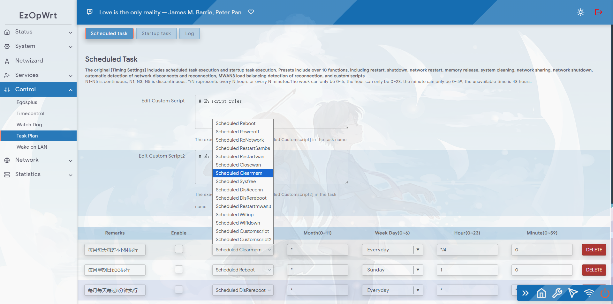

Number visits:[](https://t.me/joinchat/AAAAAEpRF88NfOK5vBXGBQ)

<h1 align="center">
  <br>Task Plan<br>
</h1>

  <p align="center">

  <a target="_blank" href="https://github.com/sirpdboy/luci-app-taskplan/releases">
    
  </a>
</p>

[中文](README_CN.md) | English


Please read this page carefully, which includes precautions and instructions on how to use it.

## Function Description:

### Task Setting Version 2.2.4 (taskplan)
#### 2025.8.7 Task Setting 2.2.4 Version: Fixed the issue of sometimes invalid custom scripts in the new version.

### Task Setting Version 2.2.2 (taskplan)
#### 2025.4.9 Task Setting 2.2.2 Version: Fixed the issue of invalid startup tasks caused by the new version.

### Task Setting 2.2.1 Version (taskplan)
#### 2025.3.19 Task Setting 2.2.1 Version: Rename luci app taskplan to differentiate from previous versions and adapt to openwrt24.10

### Timer Setting 2.0 Version
#### 2023.5.23 Timer Setting 2.0 Version: a two in one version that includes scheduled task execution and boot task settings, and adds custom script functionality.

### Timer Setting Version 1.9
#### 2023.4.1 Timer Setting Version 1.9: Added services such as timed network disconnection and reconnection, timed detection of WAN3 restart, etc.

### Timer setting version 1.6
#### 2023.1.15 Timer Setting 1.6 Version: Refactoring and Optimizing Code Production. Added 8 new features on previous versions: timed memory cleaning, timed system garbage cleaning, timed network disconnection, timed restart of network sharing, timed redialing, etc

### Timer settings version 1.4
#### 2021.2.7 Added the function of timed network restart. Now includes: timed restart, timed shutdown, timed network restart, all functions can be used together.

### Timer setting version 1.3
#### On October 6, 2020, the original reset shutdown was officially renamed as timed setting, achieving the integration of timed restart and timed shutdown functions.

### Timed shutdown version 1.1
#### On July 19, 2020, the timed shutdown function completely solved the problem of needing to save twice before it takes effect.

### Timed shutdown version 1.0
#### On February 24, 2019, the scheduled shutdown function was first released, drawing inspiration from the open-source code of predecessors.


Method for adding luci app taskplan to LEDE/OpenWRT source code.

### Method for downloading source code one:
Edit the root directory of the source code folder 'feeds.comnf.defect' and add the following content:

```Brach
    # feeds Get source code：
    src-git taskplan  https://github.com/sirpdboy/luci-app-taskplan
 ``` 
  ```Brach
   # Update feeds and install themes:
    scripts/feeds update taskplan
	scripts/feeds install luci-app-taskplan
 ``` 	

### Method for downloading source code two:
 ```Brach
    # downloading
    git clone https://github.com/sirpdboy/luci-app-taskplan package/luci-app-taskplan
    make menuconfig
 ``` 
### Configuration Menu
 ```Brach
    make menuconfig
	# find LuCI -> Applications, select luci-app-taskplan, save and exit
 ``` 
### compile
 ```Brach 
    # compile
    make package/luci-app-taskplan/compile V=s
 ```

## interface




Source code source：https://github.com/sirpdboy/luci-app-taskplan


# My other project

- Eatch Dog ： https://github.com/sirpdboy/luci-app-watchdog
- Net Speedtest ： https://github.com/sirpdboy/luci-app-netspeedtest
- Task Plan : https://github.com/sirpdboy/luci-app-taskplan
- Power Off Device : https://github.com/sirpdboy/luci-app-poweroffdevice
- OpentoPD Theme : https://github.com/sirpdboy/luci-theme-opentopd
- Ku Cat Theme : https://github.com/sirpdboy/luci-theme-kucat
- Ku Cat Theme Config : https://github.com/sirpdboy/luci-app-kucat-config
- NFT Time Control : https://github.com/sirpdboy/luci-app-timecontrol
- Parent Control: https://github.com/sirpdboy/luci-theme-parentcontrol
- Eqos Plus: https://github.com/sirpdboy/luci-app-eqosplus
- Advanced : https://github.com/sirpdboy/luci-app-advanced
- ddns-go : https://github.com/sirpdboy/luci-app-ddns-go
- Advanced Plus）: https://github.com/sirpdboy/luci-app-advancedplus
- Net Wizard: https://github.com/sirpdboy/luci-app-netwizard
- Part Exp: https://github.com/sirpdboy/luci-app-partexp
- Lukcy: https://github.com/sirpdboy/luci-app-lukcy

## HELP

|       |    | 
| :-----------------: | :-------------: |
| |  |

<a href="#readme">
    
</a>

Number visits:[](https://t.me/joinchat/AAAAAEpRF88NfOK5vBXGBQ)
