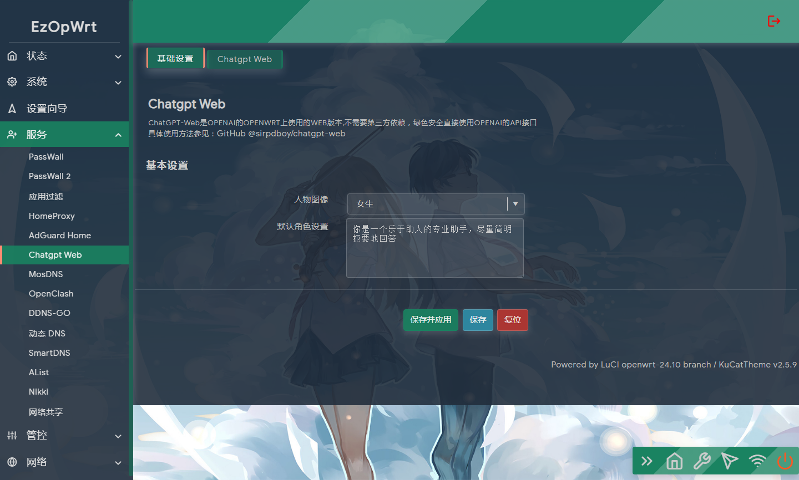
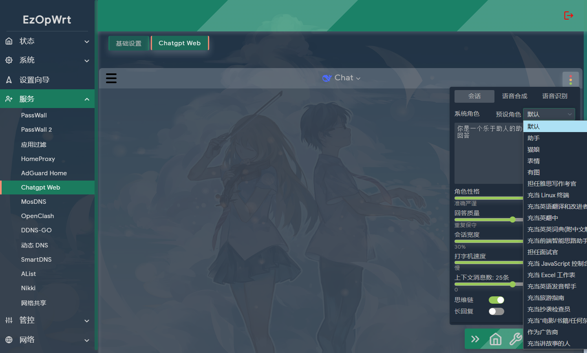

## 访问数：[](https://t.me/joinchat/AAAAAEpRF88NfOK5vBXGBQ)
### 访问数：[] [](https://t.me/joinchat/AAAAAEpRF88NfOK5vBXGBQ)


请 **认真阅读完毕** 本页面，本页面包含注意事项和如何使用。

## 功能说明

luci-app-chatgpt Pure ChatGPT by OPENWRT based on OpenAI API 

luci-app-chatgpt 在OPENWRT上实现ChatGPT项目，基于OpenAI API

<!-- TOC -->

- [luci-app-chatgpt](#功能说明)
  - [特性](#特性)
  - [编译方法](#编译方法)
  - [使用方法](#使用方法)
  - [自定义选项](#自定义选项)。
  - [说明](#说明)
  - [界面](#界面)
  - [捐助](#捐助)

<!-- /TOC -->

## 特性

- 无须第三依赖，直接使用官方API接口。
- 支持复制/更新/刷新会话，语音输入，朗读等功能，以及众多[自定义选项](#自定义选项)。
- 支持搜索会话，导入导出会话和设置，自定义头像，自定义系统角色等。

参考项目: 
[markdown-it](https://github.com/markdown-it/markdown-it), 
[highlight.js](https://github.com/highlightjs/highlight.js), 
[github-markdown-css](https://github.com/sindresorhus/github-markdown-css), 
[chatgpt-html](https://github.com/slippersheepig/chatgpt-html), 
[markdown-it-copy](https://github.com/ReAlign/markdown-it-copy), 
[markdown-it-texmath](https://github.com/goessner/markdown-it-texmath), 
[awesome-chatgpt-prompts-zh](https://github.com/PlexPt/awesome-chatgpt-prompts-zh)


## 编译方法

- 将luci-app-chatgpt添加至 LEDE/OpenWRT 源码的方法。

### 下载源码方法:

 ```Brach
 
    # 下载源码
	
    git clone https://github.com/sirpdboy/chatgpt-web.git package/luci-app-chatgpt
    make menuconfig
	
 ``` 
### 配置菜单

 ```Brach
    make menuconfig
	# 找到 LuCI -> Applications, 选择 luci-app-chatgpt, 保存后退出。
 ``` 
 
### 编译

 ```Brach 
    # 编译固件
    make package/luci-app-chatgpt/compile V=s
 ```

## 使用方法

    - 打开luci-app-chatgpt基本设置，填写API密钥、GPT模型、填写OpenAI接口、选择用户图像等。 
    
    - 可选GPT模型，默认gpt-3.5，当前使用gpt-4模型需通过openai的表单申请。
    
    - OpenAI接口当本地可正常访问`api.openai.com`，填写`https://api.openai.com/`
    
    - 不可正常访问`api.openai.com`，填写其反代地址，注意：反代接口响应需添加跨域Header `Access-Control-Allow-Origin`
    
    - chatgpt-web页面就可以正常使用了，如果需要设置更多请看 自定义设置设置语音和系统角色等。
    
## 自定义选项

- 左边栏支持，清除对话，搜索会话，新建/重命名/删除(会话/文件夹)导出/导入/重置会话和设置数据，显示本地存储。

- 可选系统角色，默认不开启，有四个预设角色，后期会加入更多角色。

- 可选角色性格，默认灵活创新，对应接口文档的top_p参数。

- 可选回答质量，默认平衡，对应接口文档的temperature参数。

- 修改打字机速度，默认较快，值越大速度越快。

- 允许连续对话，默认开启，对话中包含上下文信息，会导致api费用增加。

- 允许长回复，默认关闭，**开启后可能导致api费用增加，并丢失大部分上下文，对于一些要发送`继续`才完整的回复，不用发`继续`了。**

- 选择语音，默认Bing语音，支持Azure语音和系统语音，可分开设置提问语音和回答语音。

- 音量，默认最大。

- 语速，默认正常。

- 音调，默认正常。

- 允许连续朗读，默认开启，连续郎读到所有对话结束。

- 允许自动朗读，默认关闭，自动朗读新的回答。**（iOS需打开设置-自动播放视频预览，Mac上Safari需打开此网站的设置-允许全部自动播放）**

- 支持语音输入，默认识别为普通话，可长按语音按钮修改识别选项。**语音识别必需条件：使用chrome内核系浏览器 + https网页或本地网页。** 如点击语音按钮没反应，可能是未授予麦克风权限或者没安装麦克风设备。


## 说明

-源码来源：https://github.com/sirpdboy/chatgpt-web
-你可以随意使用其中的源码，但请注明出处。


## 界面






## 使用与授权相关说明
 
- 本人开源的所有源码，任何引用需注明本处出处，如需修改二次发布必告之本人，未经许可不得做于任何商用用途。

# My other project

- 路由安全看门狗 ：https://github.com/sirpdboy/luci-app-watchdog
- 网络速度测试 ：https://github.com/sirpdboy/luci-app-netspeedtest
- 计划任务插件（原定时设置） : https://github.com/sirpdboy/luci-app-taskplan
- 关机功能插件 : https://github.com/sirpdboy/luci-app-poweroffdevice
- opentopd主题 : https://github.com/sirpdboy/luci-theme-opentopd
- kucat酷猫主题: https://github.com/sirpdboy/luci-theme-kucat
- kucat酷猫主题设置工具: https://github.com/sirpdboy/luci-app-kucat-config
- NFT版上网时间控制插件: https://github.com/sirpdboy/luci-app-timecontrol
- 家长控制: https://github.com/sirpdboy/luci-theme-parentcontrol
- 定时限速: https://github.com/sirpdboy/luci-app-eqosplus
- 系统高级设置 : https://github.com/sirpdboy/luci-app-advanced
- ddns-go动态域名: https://github.com/sirpdboy/luci-app-ddns-go
- 进阶设置（系统高级设置+主题设置kucat/agron/opentopd）: https://github.com/sirpdboy/luci-app-advancedplus
- 网络设置向导: https://github.com/sirpdboy/luci-app-netwizard
- 一键分区扩容: https://github.com/sirpdboy/luci-app-partexp
- lukcy大吉: https://github.com/sirpdboy/luci-app-lukcy

## 捐助


|       |    | 
| :-----------------: | :-------------: |
| |  |

<a href="#readme">
    
</a>

