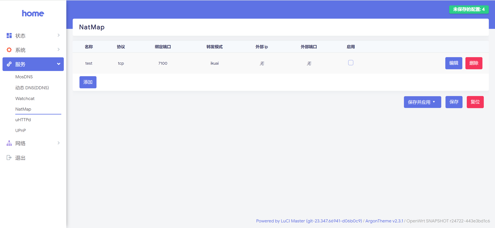
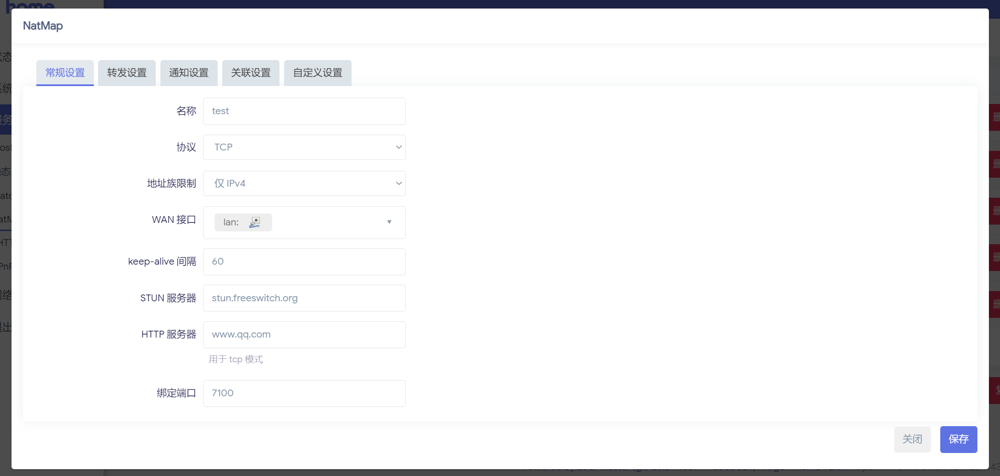

##  介绍

####    基于 openwrt master 分支的 natmap 插件

注意：自 openwrt23.0 之后，使用golang>= 1.20，luci2（js实现网页），部分插件不兼容。

## 基本功能

### 1.目前支持第三方服务调用功能
####    1.1.qBittorrent
打洞成功后，自动修改 qBittorrent 的端口号，并配置转发（可选）。
需要配置 qBittorrent 地址、账号、密码用于修改端口。
需要配置 qBittorrent 使用网卡的 IP 用于配置转发，端口填 0，会转发到修改后的端口。

####    1.2.Transmission
打洞成功后，自动修改 Transmission 的端口号，并配置转发（可选）。
需要配置 Transmission 地址、账号、密码用于修改端口。
需要配置 Transmission 使用网卡的 IP 用于配置转发，端口填 0，会转发到修改后的端口。

####    1.3.Emby
配合 Emby Connect 使用时，用户登录账号后，会从服务器获取最新的连接地址信息，此模式就是用于配置这些信息的。
需要配置 Emby 地址和 API Key 用于修改连接地址信息。
此模式必须配置转发，默认不更新「外部域」，如果有配置 DDNS，将 DDNS 域名填入外部域后将不需要再次修改。
若没有域名，需要将 IP 填入外部域，可以勾选 「Update host with IP」，若对外提供的是 HTTPS 服务，需要勾选 「Update HTTPS Port」。

####    1.4.Cloudflare Origin Rules
Cloudflare Origin Rules 可以设置回源端口，配合 DDNS 使用时，可以将 DDNS 域名指向 Cloudflare，然后将回源端口设置为打洞后的端口，这样就可以通过 Cloudflare 的 CDN 加速访问。
需要配置 Cloudflare 的 API Key，邮箱 和 Zone ID，Zone ID 可以在 Cloudflare 的域名首页找到。
API Key 请访问 https://dash.cloudflare.com/profile/api-tokens 复制 Global API Key。
需要先在 Cloudflare 后台的 Rules - Origin Rules 下添加一个 Origin Rules，然后将 Origin Rules 的 Name 填入配置中。
注意：Name 请保持唯一，否则会出现奇怪的问题。

####    1.5.Cloudflare Redirect Rules

    
### 2.目前支持的通知功能
####    2.1.  Telegram Bot
####    2.2.  PushPlus
####    2.3.  server酱
####    2.4.  Gotify

### 3.端口转发功能
####    3.1.natmap转发
支持使用natmap转发tcp和udp..

####    3.2.firewall dnat转发
支持使用openwrt防火墙转发tcp和udp。

####    3.3.ikuai端口映射
当前仅支持使用爱快系统作为主路由，可以自动设置主网关爱快系统的端口映射。

### 4.自定义脚本
支持自定义脚本


## 截图展示





## 使用

### openwrt编译时添加软件源至feeds.conf.default首行，以覆盖openwrt内置luci-app-natmap 

```
src-git zzz https://github.com/blueberry-pie-11/luci-app-natmap
```

### 编译源码，尽量使用编译固件而非插件安装

```
./scripts/feeds update -a
./scripts/feeds install -a
make
```

##  本脚本相关功能依据以下代码改写：
1.  https://github.com/EkkoG/luci-app-natmap
2.  https://github.com/EkkoG/openwrt-natmap
3.  https://github.com/loyux/ikuai_local_api
4.  https://github.com/ztc1997/ikuai-bypass


