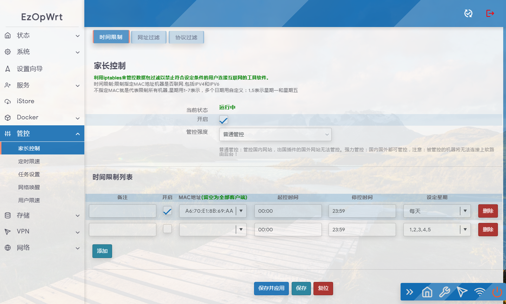
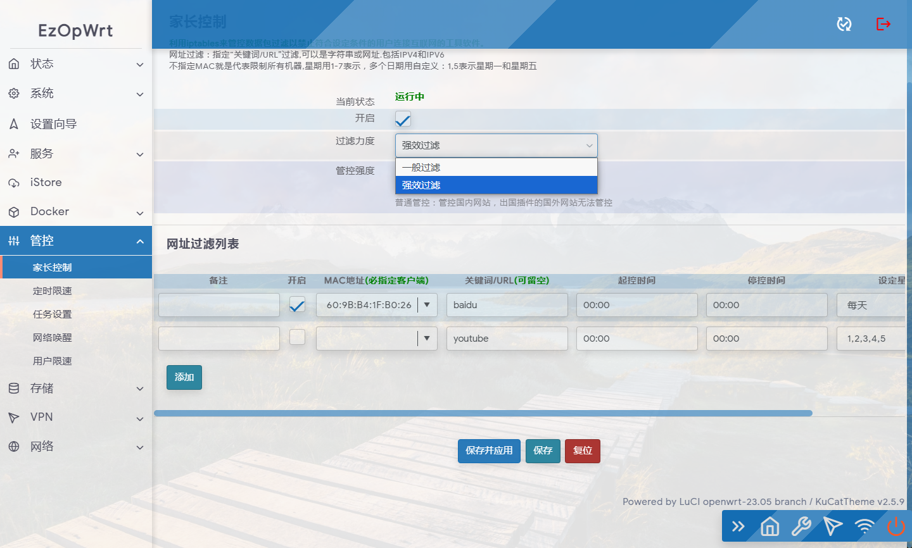
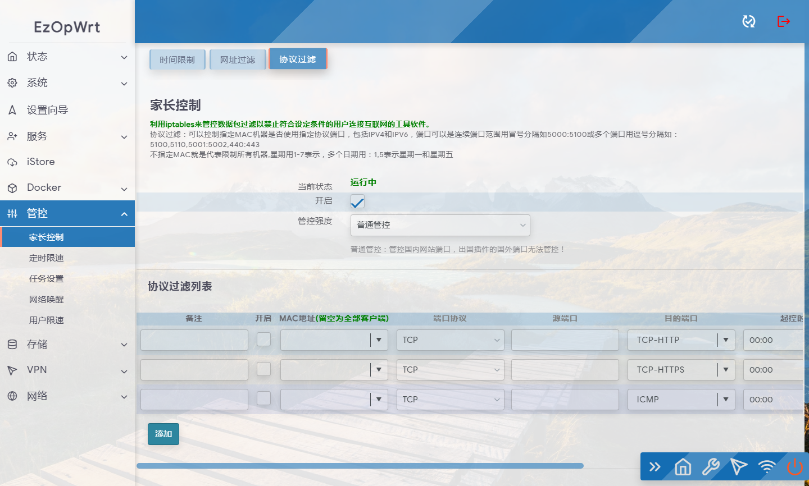

## 访问数：
### 访问数：[] 

# luci-app-parentcontrol

https://github.com/sirpdboy/luci-app-parentcontrol

家长控制 ，可以按时间控制机器，端口和关键字过滤等。

本家长控制，是2022年群里某生找本人出钱定制界面开发，代码原来网上开源代码只是不符合要求，请本人二次开发，现经和需求方协议将代码开源！以感谢大家的支持与鼓励！！也算是为OPENWRT开源代码添砖加瓦！

当然，本身这代码也不是一个什么很高级的代码，权当是抛砖引玉，如果有什么不足之处，欢迎一起ISSE使之更完善。

最初版本参考Lienol大的网址过滤源码和参考部分网上开源代码而来。

参考来源：
https://github.com/Lienol/openwrt-package/tree/main/luci-app-control-weburl

## 界面

# My other project

- 路由安全看门狗 ：https://github.com/sirpdboy/luci-app-watchdog
- 网络速度测试 ：https://github.com/sirpdboy/luci-app-netspeedtest
- 计划任务插件（原定时设置） : https://github.com/sirpdboy/luci-app-taskplan
- 关机功能插件 : https://github.com/sirpdboy/luci-app-poweroffdevice
- opentopd主题 : https://github.com/sirpdboy/luci-theme-opentopd
- kucat酷猫主题: https://github.com/sirpdboy/luci-theme-kucat
- kucat酷猫主题设置工具: https://github.com/sirpdboy/luci-app-kucat-config
- NFT版上网时间控制插件: https://github.com/sirpdboy/luci-app-timecontrol
- 家长控制: https://github.com/sirpdboy/luci-theme-parentcontrol
- 定时限速: https://github.com/sirpdboy/luci-app-eqosplus
- 系统高级设置 : https://github.com/sirpdboy/luci-app-advanced
- ddns-go动态域名: https://github.com/sirpdboy/luci-app-ddns-go
- 进阶设置（系统高级设置+主题设置kucat/agron/opentopd）: https://github.com/sirpdboy/luci-app-advancedplus
- 网络设置向导: https://github.com/sirpdboy/luci-app-netwizard
- 一键分区扩容: https://github.com/sirpdboy/luci-app-partexp
- lukcy大吉: https://github.com/sirpdboy/luci-app-lukcy

## 捐助

|       |    | 
| :-----------------: | :-------------: |
| |  |

