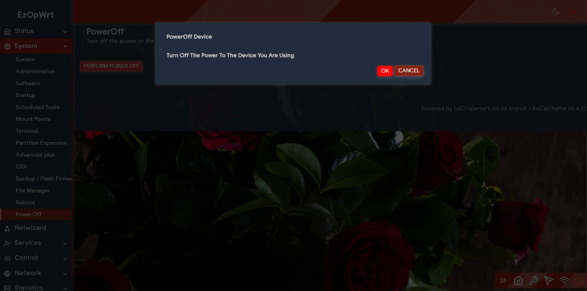
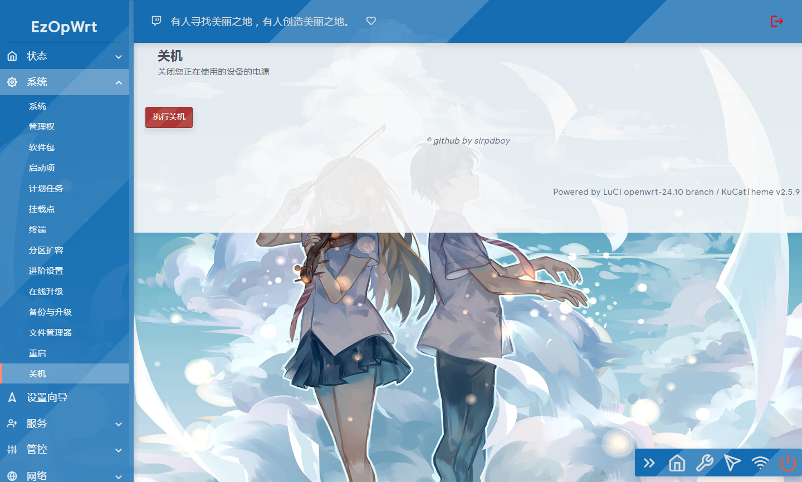
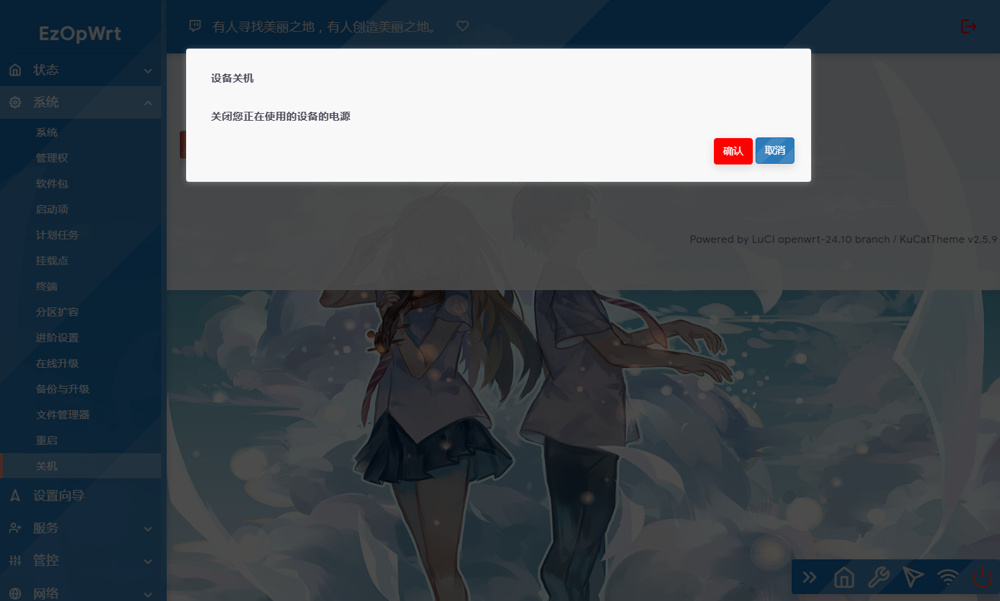

 [](https://t.me/joinchat/AAAAAEpRF88NfOK5vBXGBQ)

<h1 align="center">
  <br>poweroffdevice<br>
</h1>

  <p align="center">

  <a target="_blank" href="https://github.com/sirpdboy/luci-app-poweroffdevice/releases">
    
  </a>
</p>

[中文] | [English](README.md) 


#### One click automatic formatting of partitions, expansion, and automatic mounting of plugins, designed specifically for OPENWRT to simplify the tedious operation of partition mounting for OPENWRT. This plugin requires a lot of effort from Sirpdboy to create and test. Please do not delete the creator's information!!


Poweroffdevice is a shutdown source code plugin compiled based on OPNEWRT.


## Write it at the beginning: 
- The earliest user of this shutdown function was the firmware of KOOLSHARE. Due to the lack of a shutdown patch in OPENWRT, I am grateful for the efforts of my predecessors. I started using this plugin for the first time on OPENWRT in April 2020, and this source code was modified from the official source code reboot
A friend has been asking before how to use the shutdown plugin. There are two ways to use the shutdown plugin. One is to download plugins for compilation, which takes up relatively more resources, and the other is to modify the system's source code.

 
## Characteristics
Luci app parexp automatically obtains formatted partition expansion and automatically mounts plugins


### Method for downloading source code:

 ```Brach
    # downloading
    
    git clone https://github.com/sirpdboy/luci-app-poweroffdevice package/luci-app-poweroffdevice
    
    make menuconfig
 ``` 
### Configuration Menu
 ```Brach
    make menuconfig
	# find LuCI -> Applications, select luci-app-poweroffdevice, save and exit
 ``` 
 ```Brach 
    # compile
    make package/luci-app-poweroffdevice/{clean,compile} V=s
 ```

## interface








## describe

poweroffdevice：https://github.com/sirpdboy/luci-app-poweroffdevice


# My other project

- Watch Dog ： https://github.com/sirpdboy/luci-app-watchdog
- Net Speedtest ： https://github.com/sirpdboy/luci-app-netspeedtest
- Task Plan : https://github.com/sirpdboy/luci-app-taskplan
- Power Off Device : https://github.com/sirpdboy/luci-app-poweroffdevice
- OpentoPD Theme : https://github.com/sirpdboy/luci-theme-opentopd
- Ku Cat Theme : https://github.com/sirpdboy/luci-theme-kucat
- Ku Cat Theme Config : https://github.com/sirpdboy/luci-app-kucat-config
- NFT Time Control : https://github.com/sirpdboy/luci-app-timecontrol
- Parent Control: https://github.com/sirpdboy/luci-theme-parentcontrol
- Eqos Plus: https://github.com/sirpdboy/luci-app-eqosplus
- Advanced : https://github.com/sirpdboy/luci-app-advanced
- ddns-go : https://github.com/sirpdboy/luci-app-ddns-go
- Advanced Plus）: https://github.com/sirpdboy/luci-app-advancedplus
- Net Wizard: https://github.com/sirpdboy/luci-app-netwizard
- Part Exp: https://github.com/sirpdboy/luci-app-partexp
- Lukcy: https://github.com/sirpdboy/luci-app-lukcy

## HELP

|       |    | 
| :-----------------: | :-------------: |
| |  |

<a href="#readme">
    
</a>

 [](https://t.me/joinchat/AAAAAEpRF88NfOK5vBXGBQ)
