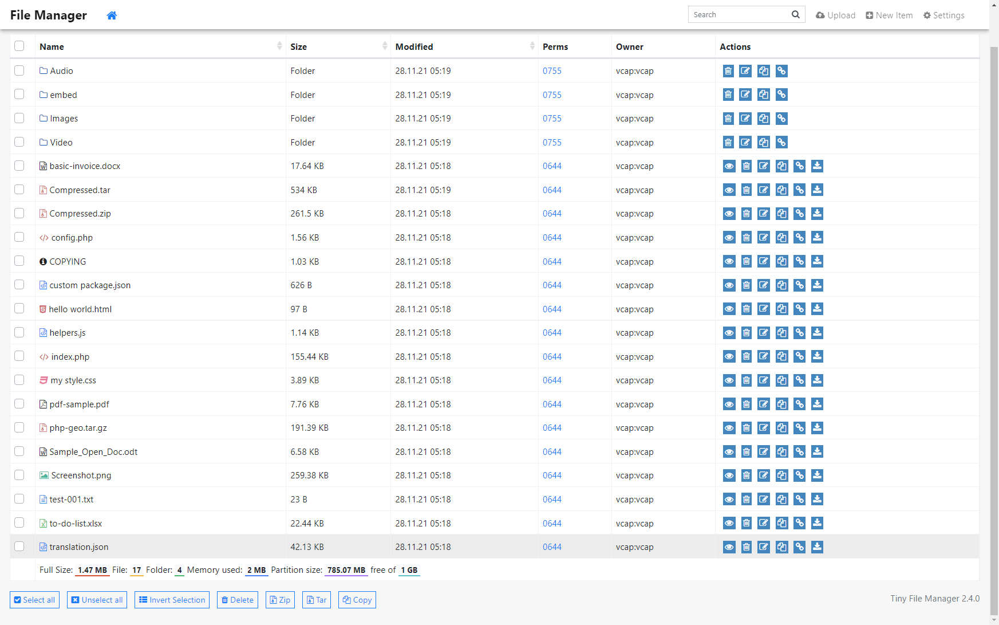
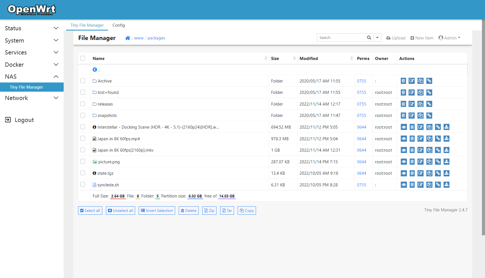
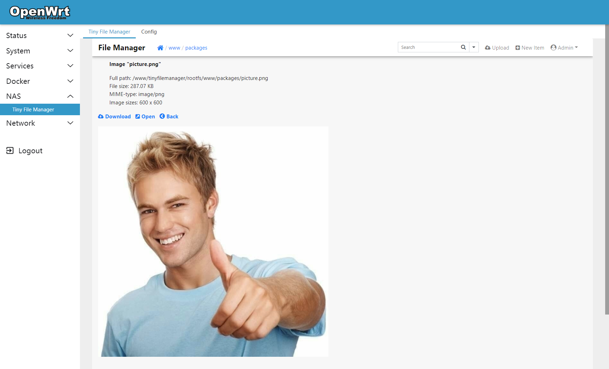
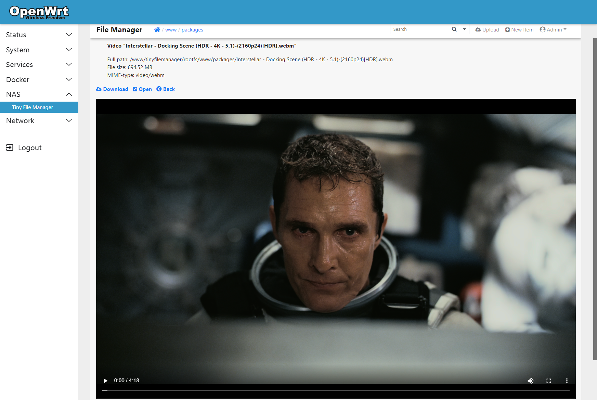

# LuCI Tiny File Manager
> [TinyFileManager][] is web based file manager and it is a simple, fast and small file manager with a single file, multi-language ready web application for storing, uploading, editing and managing files and folders online via web browser. The Application runs on PHP 5.5+, It allows the creation of multiple users and each user can have its own directory and a build-in support for managing text files with cloud9 IDE and it supports syntax highlighting for over 150+ languages and over 35+ themes.

### Screenshots

  

<details><summary>Real installation</summary>




</details>

### How to install

1. Goto ~~[releases](https://github.com/muink/luci-app-tinyfilemanager/tree/releases)~~ [here](https://fantastic-packages.github.io/packages/)
2. Download the latest version of ipk
3. Login router and goto **System --> Software**
4. Upload and install ipk
5. Reboot if the app is not automatically added in page
6. Goto **NAS --> Tiny File Manager**
7. Default username/password: admin/admin and user/12345.

### Uploading limit

**If you need to change the upload limit for Tiny File Manager**

Edit [config.js](htdocs/luci-static/resources/view/tinyfilemanager/config.js) before build  
Edit `/www/luci-static/resources/view/tinyfilemanager/config.js` in router  
```javascript
o = s.option(form.Value, 'max_upload_size', _('Max upload size (MBytes)'));
o.datatype = "and(uinteger,max(2048))";  //limit to 2048MB
```
And edit [Makefile](Makefile) before build  
```makefile
total_size_limit=??        #Total size of multiple files
single_size_limit=??       #Max single file size
otime_uploads_limit=??     #Max count of simultaneous uploads
```
And edit `/etc/php.ini` in router 
```ini
post_max_size = ??          ;Total size of multiple files
upload_max_filesize = ??    ;Max single file size
max_file_uploads = ??       ;Max count of simultaneous uploads
```

### Build

- Compile from OpenWrt/LEDE SDK

```
# Take the x86_64 platform as an example
tar xjf openwrt-sdk-21.02.3-x86-64_gcc-8.4.0_musl.Linux-x86_64.tar.xz
# Go to the SDK root dir
cd OpenWrt-sdk-*-x86_64_*
# First run to generate a .config file
make menuconfig
./scripts/feeds update -a
./scripts/feeds install -a
# Get Makefile
git clone --depth 1 --branch master --single-branch --no-checkout https://github.com/muink/luci-app-tinyfilemanager.git package/luci-app-tinyfilemanager
pushd package/luci-app-tinyfilemanager
umask 022
git checkout
popd
# Select the package LuCI -> Applications -> luci-app-tinyfilemanager
make menuconfig
# Upgrade to new version Tiny File Manager (optional)
1. modify the tag VERSION='2.4.7' to new version in makenew.sh
2. run makenew.sh to upgrade current version (if it worked)
# Start compiling
make package/luci-app-tinyfilemanager/compile V=99
```

### Contributors

- [prasathmani](https://tinyfilemanager.github.io)
- [muink](https://github.com/muink)

[TinyFileManager]: https://github.com/prasathmani/tinyfilemanager

### License

- This project is licensed under the [GPL-3.0](https://www.gnu.org/licenses/gpl-3.0.html)
