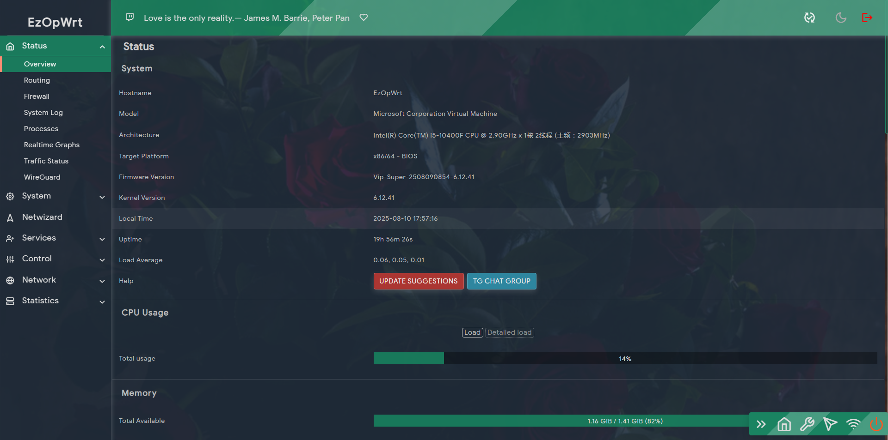
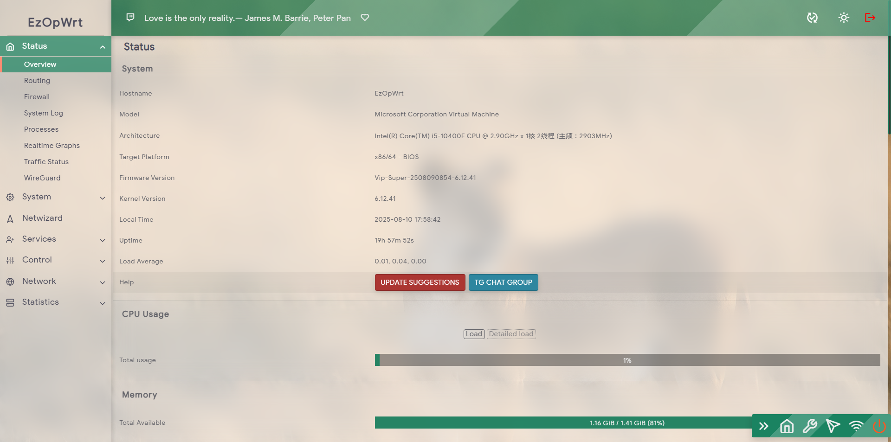
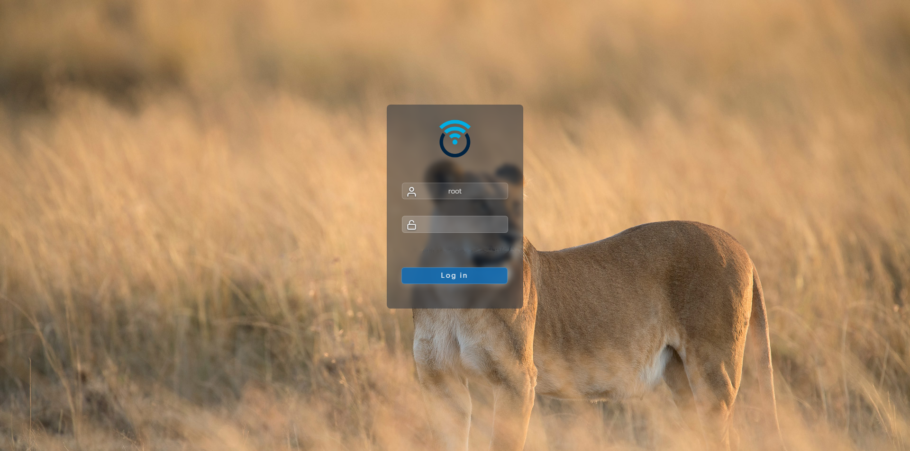
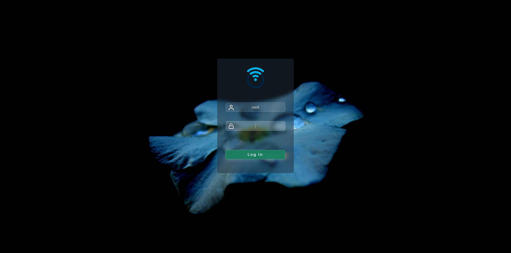
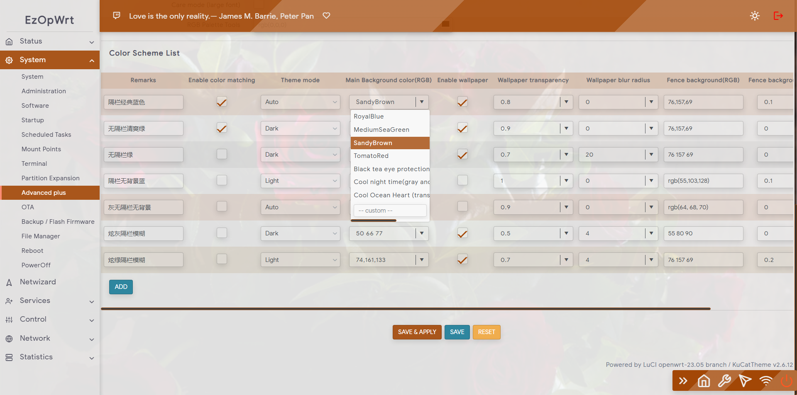
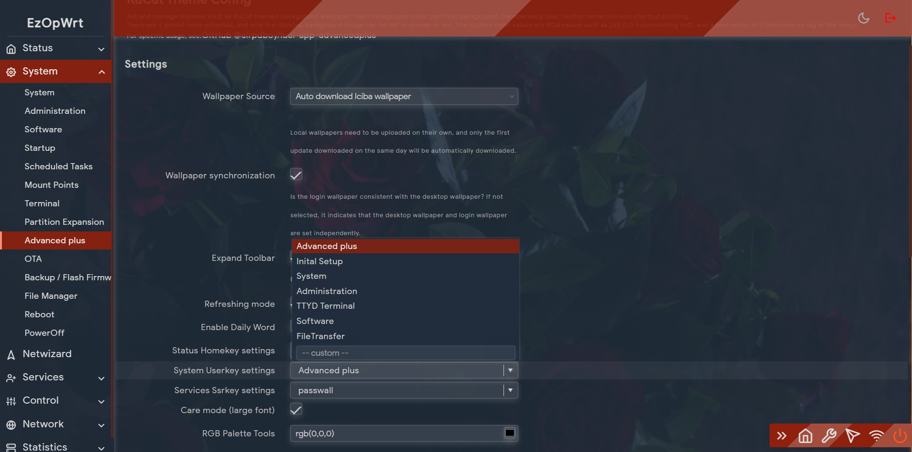
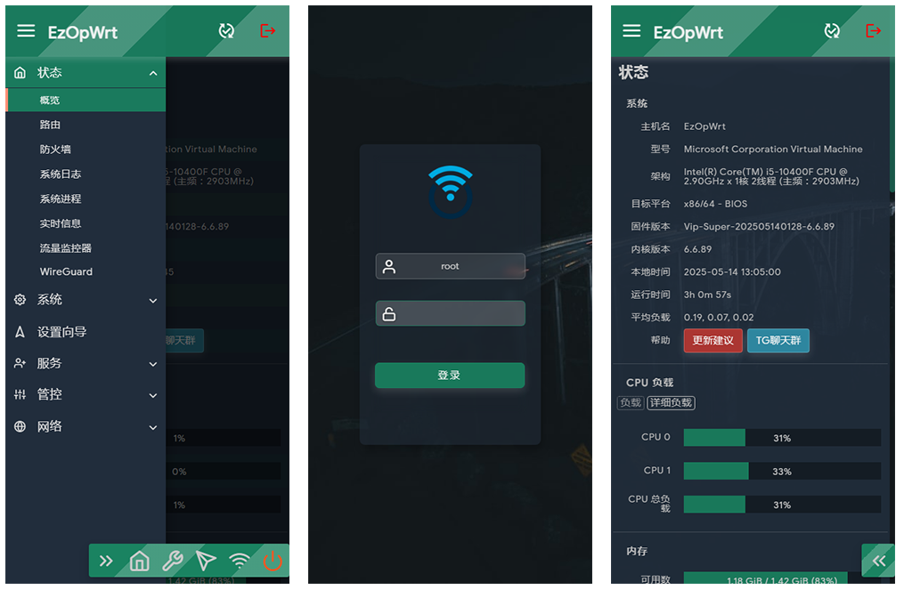
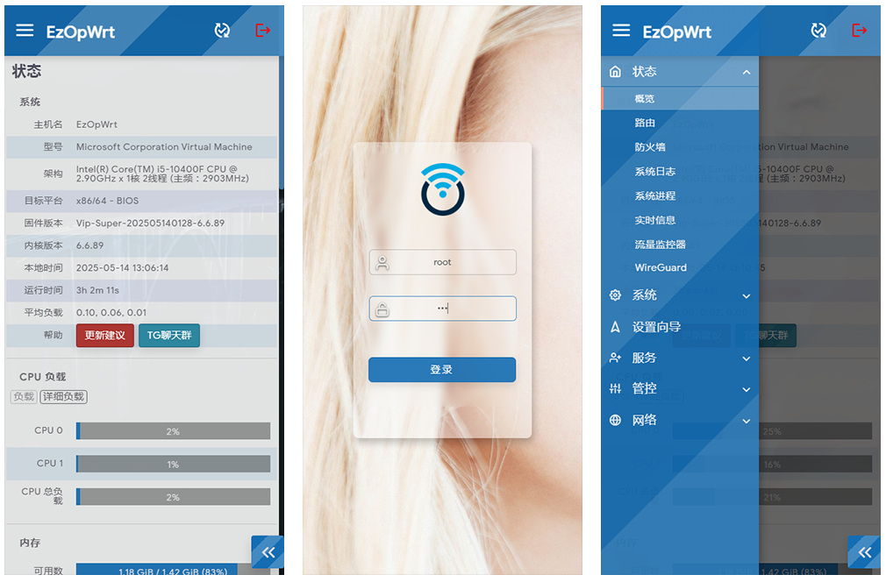

 

<h1 align="center">
   luci-theme-kucat  
</h1>

  

  

[中文](README_CN.md) | [English]

# [luci-theme-kucat](https://github.com/sirpdboy/luci-theme-kucat)
- Development time: December 2021
- Release time: February 2023
- Open source date: April 2023
- Main supports LEDE18.06 and official 18.06 branch open source time: April 2023 version: 1.2.6
- JS supports official website 19.07-24.10 branch latest version: May 2025 version: 2.5.9 compatible with OPENWRT 24.10 branch.

# Function Introduction
- Being cool is beauty, born from movement.
- A toolbar with 5 shortcut keys.
- Basic BUG, adapted to all plugins currently available
- We have made a lot of optimizations for mobile phones and other devices
- There are matching theme setting tools, which can adjust shortcut keys, background images, and various color schemes to choose from.

# As mentioned earlier, the development of the Cool Cat theme drew inspiration and borrowed some code from Opentopd theme, Jerryk God's Argon theme, and Thinktip God's Neobird theme. Thank you for your valuable contributions!

# Special Instructions
- When there are advanced settings and KUCAT theme setting tools in the system, the settings in the advanced settings shall prevail.
- If there are any issues with the settings, you can restore them using function 4 after logging in via SSH.
- If it is an advanced setting, to restore the default settings, you can use:/etc/init.d/advancedplus reset
- If it is the KUCAT setting tool, to restore the default settings, you can use:/etc/init.d/kucat reset

## describe

- luci-theme-kucat  ：https://github.com/sirpdboy/luci-theme-kucat
- luci-app-advancedplus  ：https://github.com/sirpdboy/luci-app-advancedplus
- luci-app-kucat-config  ：https://github.com/sirpdboy/luci-app-kucat-config 

## interface

# My other project

- Watch Dog ： https://github.com/sirpdboy/luci-app-watchdog
- Net Speedtest ： https://github.com/sirpdboy/luci-app-netspeedtest
- Task Plan : https://github.com/sirpdboy/luci-app-taskplan
- Power Off Device : https://github.com/sirpdboy/luci-app-poweroffdevice
- OpentoPD Theme : https://github.com/sirpdboy/luci-theme-opentopd
- Ku Cat Theme : https://github.com/sirpdboy/luci-theme-kucat
- Ku Cat Theme Config : https://github.com/sirpdboy/luci-app-kucat-config
- NFT Time Control : https://github.com/sirpdboy/luci-app-timecontrol
- Parent Control: https://github.com/sirpdboy/luci-theme-parentcontrol
- Eqos Plus: https://github.com/sirpdboy/luci-app-eqosplus
- Advanced : https://github.com/sirpdboy/luci-app-advanced
- ddns-go : https://github.com/sirpdboy/luci-app-ddns-go
- Advanced Plus）: https://github.com/sirpdboy/luci-app-advancedplus
- Net Wizard: https://github.com/sirpdboy/luci-app-netwizard
- Part Exp: https://github.com/sirpdboy/luci-app-partexp
- Lukcy: https://github.com/sirpdboy/luci-app-lukcy

## HELP

|       |    | 
| :-----------------: | :-------------: |
| |  |

 
